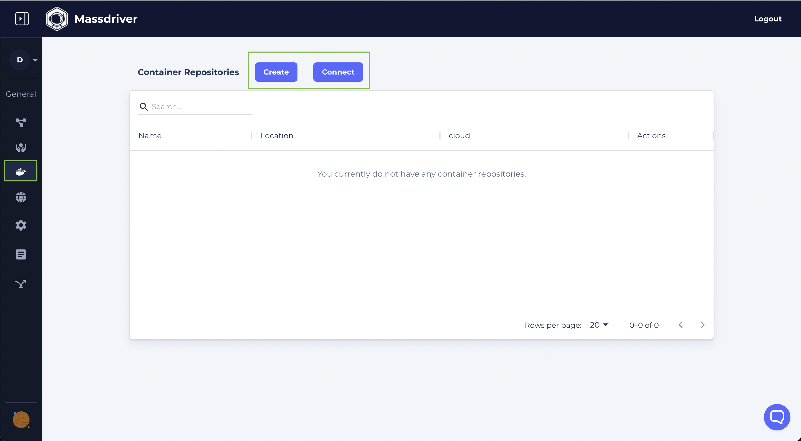
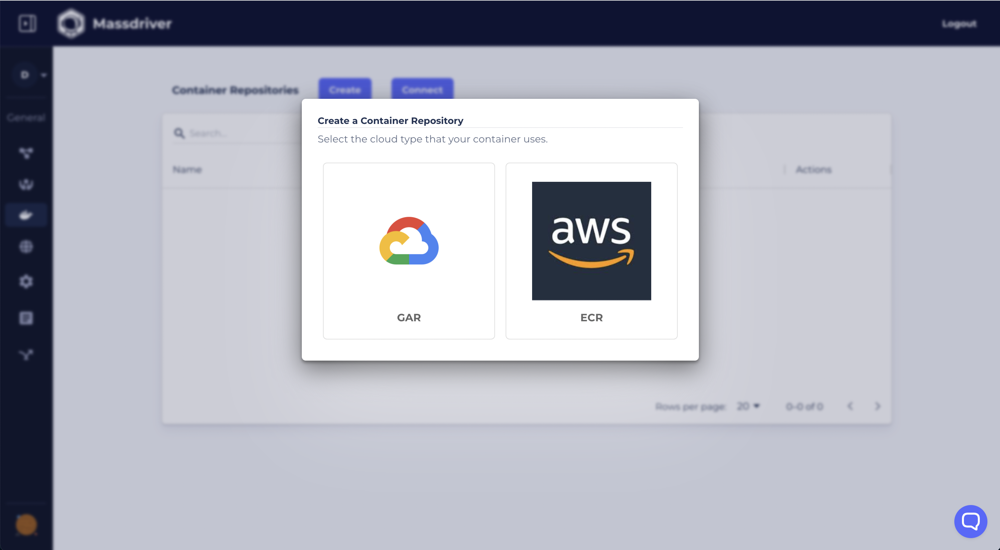
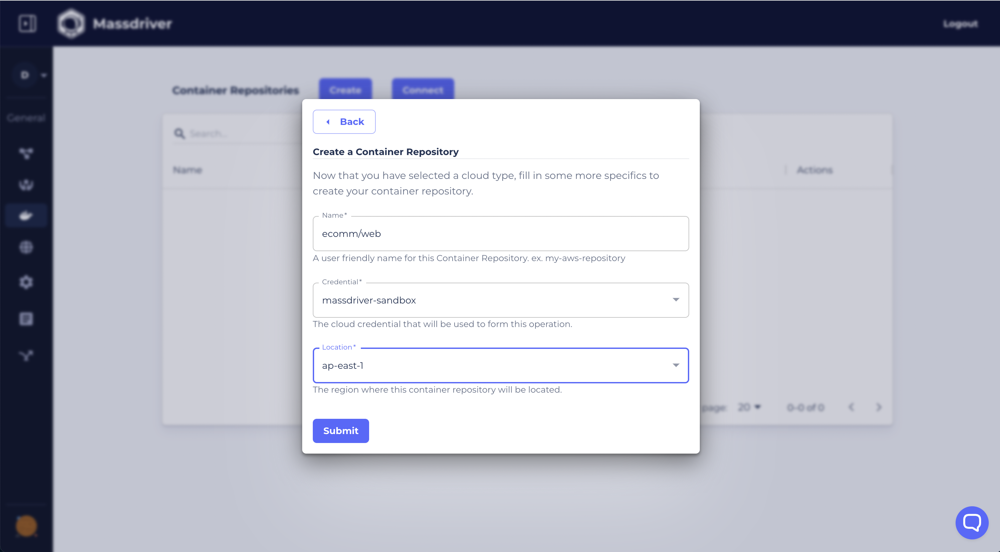

:::note

Azure Container Repositories are not currently supported in the Massdriver UI and must be created using the Azure Console or CLI tool.

:::

Container Repositories can be created in or imported from AWS, Azure, and GCP. Connecting a DNS Zone in Massdriver allows our [Container Repositories Widget](/bundles/custom-widgets-and-fields#container-repositories) to create a rich dropdown for selecting repositories, and can be used by Kubernetes clusters to automatically configure ImagePullSecrets.

To create a Container Repository or connect an existing Container Repositories:

1. Visit the [Container Repos' page](https://app.massdriver.cloud/container-repositories)
2. Click 'Create' to create a new repository or 'Connect' to connect to an existing repository.
3. Select the cloud the repository will be managed by.
4. Set the repository name and pick the credential and location for provisioning.

