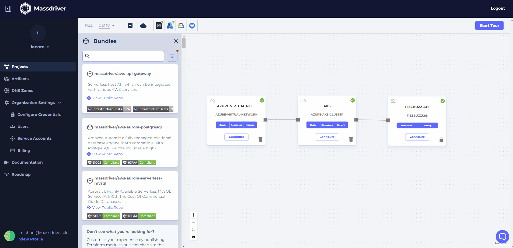
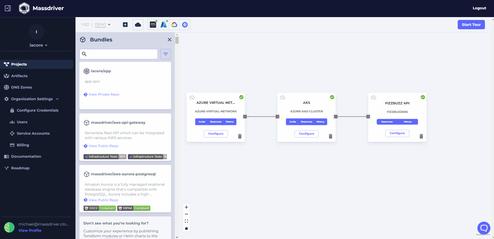
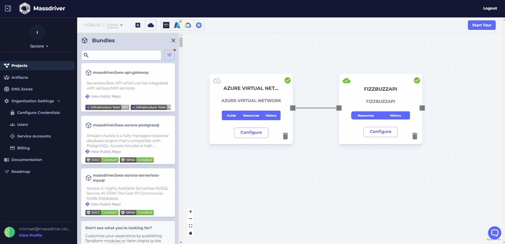

The next step in your journey is to add DNS to your FizzBuzz API project. DNS is a critical component of any application and Massdriver makes it easy to add DNS to your application.

:::note
Requirements:
- A registered DNS domain
- A cloud provider account (AWS, GCP, Azure)
- Cloud provider credentials [configured in Massdriver](https://app.massdriver.cloud/organization/credentials)
:::

## Add DNS to Massdriver
To create a DNS zone (or link an exising one):
1. Visit the [DNS Zones page](https://app.massdriver.cloud/dns-zones)
2. Click **Create** to create a new zone, or **Connect** to connect an existing zone
3. Select the cloud you want to use for DNS
4. Fill out the form and click **Submit**

## Add your cloud DNS zone to your domain registrar
* [AWS Route 53](/platform/custom-dns/route53)
* [Google Domains](/platform/custom-dns/google)
* [Cloudflare](/platform/custom-dns/cloudflare)
* [NameCheap](/platform/custom-dns/namecheap)
* [GoDaddy](/platform/custom-dns/godaddy)

:::note
If your domain registar is not listed, please [let us know](https://roadmap.massdriver.cloud) by leaving feedback! 
:::

## Kubernetes
1. Click **Configure** on the kubernetes bundle
2. Select your DNS zone from the dropdown
3. Click **Deploy**

:::info
Massdriver will automatically deploy the DNS zone to your cluster, using [cert-manager](https://cert-manager.io/docs/) and [external-dns](https://github.com/kubernetes-sigs/external-dns) helm charts. Cert-manager adds certificates and certificate issuers as resource types in Kubernetes clusters, and simplifies the process of obtaining, renewing and using those certificates. ExternalDNS allows you to control DNS records dynamically via Kubernetes resources in a DNS provider-agnostic way. ExternalDNS synchronizes exposed Kubernetes Services and Ingresses with DNS providers.
:::

### Add DNS to your kubernetes deployment
1. Click **Configure** on the FizzBuzz application
2. Set your DNS hostname to `fizzbuzz.yourdomain.com`
3. Click **Deploy**

## Serverless
1. Click **Configure** on the FizzBuzz application
2. Select your DNS zone from the dropdown
3. Set your subdomain to `fizzbuzz`
4. Click **Deploy**

:::info
Massdriver will automatically handle the IAM/RBAC needed to deploy your DNS zone to your serverless app runtime using least privilege access best practices.
:::