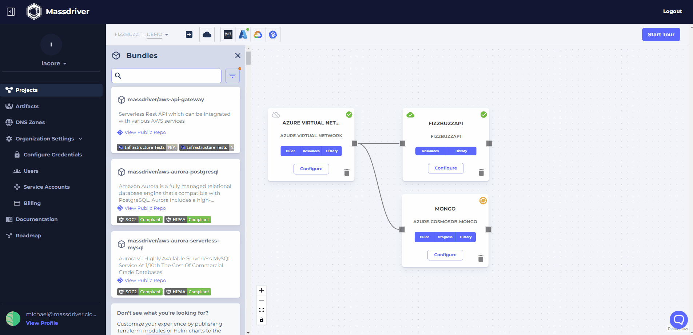

[Environments](/concepts/environments) are where Massdriver bundles are deployed. Environments can be modeled by application stage (production, staging, development), by region (prod-usw, prod-eu), and even by your customers (cloud credentials are set per environment). Environments have parity of resources, but _not scale_. This allows environments to share the same architecture of infrastructure and applications, but have different configurations based on the intention of the environment. When you create a new environment, your architecture is automatically replicated and ready to deploy.

Environments, like deployments, can also be diffed. This allows you to quickly see the different configurations between environments.

