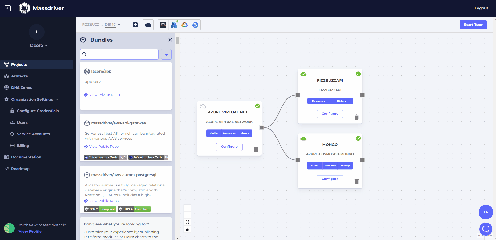

When you're done with your FizzBuzz API application, you can delete your environments. To delete an environment with no deployed bundles, click on your project in the top left of the canvas and click the trash can icon next to your new environment. 

Before deleting an environment with deployed resources, you must first decommission the bundles within that environment. To decommission a bundle, click on the trash can icon on the bundle tile. Confirm decommissioning by copy/pasting the bundle slug into the text box. Once all bundles are decommissioned, you can delete the environment, and then the project.

