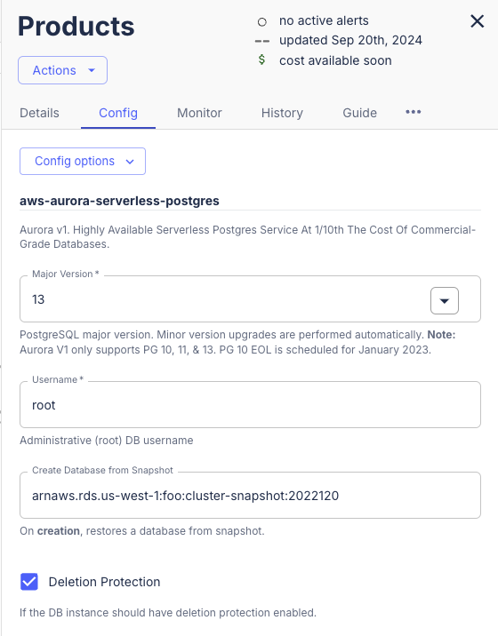

import Tabs from '@theme/Tabs';
import TabItem from '@theme/TabItem';

There are a number of options for migrating databases on AWS. This runbook takes a safe approach that will incur _downtime_, but provides a risk-free rollback mechanism.


:::note
Before getting started, RDS supports in-place major version upgrades by simply changing the major version. Through the Massdriver UI, you can simply pick the new version and click "deploy." 

RDS will perform the upgrade, with some downtime. Any issues with the upgrade will require restoring a snapshot to a new database.

This guide, while _also_ incurring downtime provides a safer approach that allows for testing and quick rollbacks.

**You may want to put up a maintenance page or send a notification to your users before proceeding.**
:::

## Creating an RDS Snapshot

To simplify creating a snapshot, we'll set a few environment variables and run the snapshot command using the [AWS CLI](https://aws.amazon.com/cli/).

You'll first need to get your `cluster ARN` or `instance ARN` for your cluster:


```shell
export RDS_MIGRATION_DB_IDENTIFIER=THE_IDENTIFIER_FROM_THE_GIF_ABOVE
export RDS_MIGRATION_SNAPSHOT_REGION=YOUR_RDS_REGION_HERE
export RDS_MIGRATION_AWS_ACCOUNT_ID=YOUR_AWS_ACCOUNT_ID_HERE
export RDS_MIGRATION_SNAPSHOT_IDENTIFIER="rds-upgrade-$(date +%s)"
```

<Tabs groupId="db-types">
<TabItem value="cluster" label="RDS Cluster">

Take a snapshot of your database:

```shell
export RDS_MIGRATION_SNAPSHOT_ARN=$(aws rds create-db-cluster-snapshot --db-cluster-snapshot-identifier ${RDS_MIGRATION_SNAPSHOT_IDENTIFIER} --db-cluster-identifier ${RDS_MIGRATION_DB_IDENTIFIER} --region ${RDS_MIGRATION_SNAPSHOT_REGION} --output json --query 'DBClusterSnapshot.DBClusterSnapshotArn')
```

Wait for the snapshot to become available:

```shell
aws rds wait db-cluster-snapshot-available --region ${RDS_MIGRATION_SNAPSHOT_REGION} --db-cluster-snapshot-identifier ${RDS_MIGRATION_SNAPSHOT_ARN}
```

</TabItem>
<TabItem value="instance" label="RDS Instance">

Take a snapshot of your database:

```shell
export RDS_MIGRATION_SNAPSHOT_ARN=$(aws rds create-db-snapshot --db-snapshot-identifier ${RDS_MIGRATION_SNAPSHOT_IDENTIFIER} --db-instance-identifier ${RDS_MIGRATION_DB_IDENTIFIER} --region ${RDS_MIGRATION_SNAPSHOT_REGION} --output json --query 'DBSnapshot.DBSnapshotArn')
```

Wait for the snapshot to become available:

```shell
aws rds wait db-snapshot-available --region ${RDS_MIGRATION_SNAPSHOT_REGION} --db-snapshot-identifier ${RDS_MIGRATION_SNAPSHOT_ARN}
```

</TabItem>
</Tabs>

## Deploying a new RDS Database w/ your Snapshot

Log into the Massdriver UI and add a new RDS manifest to your canvas. Make sure to set the SQL version to your **current** version of SQL, _not_ the version you are planning to upgrade to.

:::note
At Massdriver we tend to treat our data stores as 'cattle' and include the data in (MMYY) format as a suffix of when the database was created.
:::


Click `configure` on your manifest:



You'll set `Create Data from Snapshot` field to the value of:

```shell
echo $RDS_MIGRATION_SNAPSHOT_ARN
```


Click `Deploy` to deploy the new database. 

## Upgrade the SQL Version

After it has finished provisioning, you can perform a _Major Version_ upgrade on the database to the new version your SQL server.

It can take a few minutes to spin up.

Click `configure` and select the version from the dropdown:


This can take a while.

Once the upgrade is complete you can replace the connection line from your old database with your new database, redeploy your application to get the new credentials and you are good to go!

If there are any issues with the new version of your RDS SQL database, you can draw a line back to the old version, redeploy your application and you'll be back to your original dataset.

## Cleanup

At this point there will be the old version of your RDS database running on your canvas as well. Once you have confirmed that your application is working on the newer version of RDS, you can decommission your old database.

