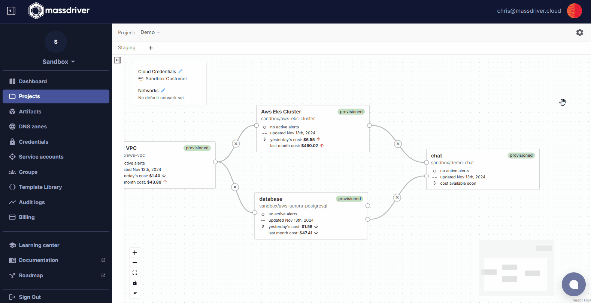

This guide will cover how to access your Kubernetes cluster using a _kubeconfig_ file and a tool called `kubectl`.

## Prerequisites

- A running Kubernetes cluster in Massdriver (AKS, EKS, or GKE)
- [kubectl](https://kubernetes.io/docs/tasks/tools) installed

## Downloading your kubeconfig file

1. In Massdriver, navigate to the Kubernetes cluster you want to access
2. Click on the deployment and open the `Details` tab
3. Under **Artifacts**, click the download button and then click `Kube Config`



## Setting KUBECONFIG environment variable

:::note
By default, `kubectl` looks for a file named `config` in the `$HOME/.kube` directory. If you want to use a different kubeconfig file, you can specify it using the `KUBECONFIG` environment variable.
:::

1. Move the downloaded kubeconfig file to a location of your choice (preferably in the `$HOME/.kube` directory)

2. In your terminal, set the `KUBECONFIG` environment variable to the path of the downloaded kubeconfig file

```bash
export KUBECONFIG=/path/to/kubeconfig.yaml
```

_You can also specify other kubeconfig files by setting the `--kubeconfig` flag for `kubectl` commands._

## Basic commands

### Get cluster information

**General**:

```bash
kubectl get namespaces  # Lists all namespaces
kubectl api-resources   # Lists all resources in the cluster
```

**Pods**:

```bash
kubectl get pods                 # Lists all pods in default namespace
kubectl get pods -n <namespace>  # Lists all pods in a specific namespace
kubectl get pods -A              # Lists all pods in all namespaces
kubectl get pods -w              # Watches for changes to pods
kubectl get pods -o wide         # Lists pods with more information
kubectl describe pod <pod-name>  # Describes a specific pod
kubectl top pod <pod-name>       # Shows CPU and memory usage of a specific pod
kubectl logs <pod-name>          # Shows logs of a specific pod
kubectl logs -f <pod-name>       # Shows logs of a specific pod and follows the logs
```

**Services**:

```bash
kubectl get services                    # Lists all services in default namespace
kubectl get services -n <namespace>     # Lists all services in a specific namespace
kubectl describe service <service-name> # Describes a specific service
```

**Nodes**:

```bash
kubectl get nodes                   # Lists all nodes
kubectl describe node <node-name>   # Describes a specific node
```

**Deployments**:

```bash
kubectl get deployments                        # Lists all deployments in default namespace
kubectl get deployments -n <namespace>         # Lists all deployments in a specific namespace
kubectl describe deployment <deployment-name>  # Describes a specific deployment
```

### Accessing cluster resources

```bash
kubectl exec -it <pod-name> -- sh       # Executes a shell in a specific pod
kubectl exec -it <pod-name> -- env      # Prints environment variables of a specific pod
kubectl port-forward <pod-name> 8080:80 # Forwards a local port to a port on a specific pod
kubectl apply -f <file.yaml>            # Applies a configuration file to the cluster
```
