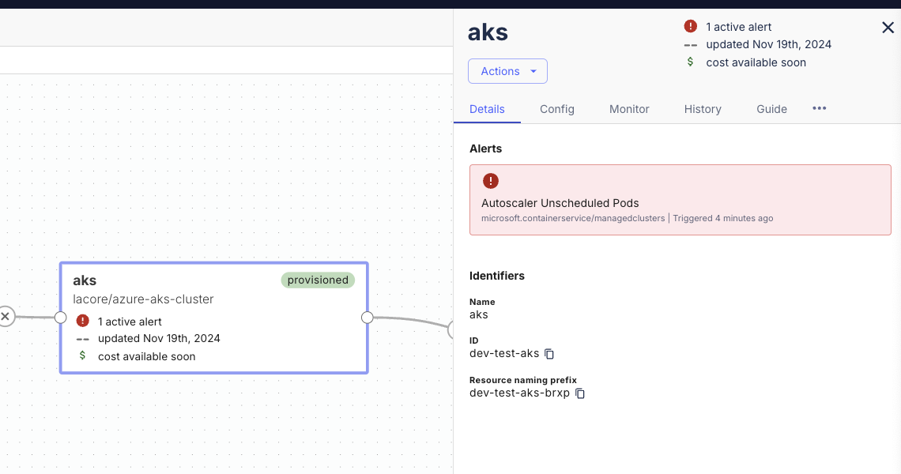

This guide is for those who want to remove the built-in Prometheus monitoring solution that comes pre-configured with Massdriver official Kubernetes bundles ([AKS](https://github.com/massdriver-cloud/azure-aks-cluster), [EKS](https://github.com/massdriver-cloud/aws-eks-cluster), [GKE](https://github.com/massdriver-cloud/gcp-gke-cluster)).


:::caution
Removing the built-in Prometheus monitoring solution will also disable Massdriver's package alarm feature for your Kubernetes deployment. 
:::

These changes will need to be made on both the Kubernetes [cluster](#kubernetes-cluster) and also on all [applications](#kubernetes-application) running on your Kubernetes cluster.

:::note
These changes can be made on an active cluster without impacting running applications.
:::

## Kubernetes Cluster

1. Open your `massdriver.yaml` and remove the entire `monitoring` block.

<details>
    <summary>Monitoring block may look like:</summary>

```yaml
monitoring:
  type: object
  title: Monitoring
  required:
    - prometheus
  properties:
    prometheus:
      type: object
      title: Prometheus Configuration
      description: Configuration settings for the Prometheus instances that are automatically installed into the cluster to provide monitoring capabilities
      required:
        - grafana_enabled
      properties:
        grafana_enabled:
          title: Enable Grafana
          type: boolean
          description: Install Grafana into the cluster to provide a metric visualizer
          default: false
      dependencies:
        grafana_enabled:
          oneOf:
          - properties:
              grafana_enabled:
                const: false
          - properties:
              grafana_enabled:
                const: true
              grafana_password:
                title: Grafana Admin Password
                description: Set the password for the `admin` user
                type: string
                format: password
            required:
            - grafana_password
```

</details>

2. Remove `monitoring` from the `required` block in `params`, and also from the `ui` block.

3. In `core-services/core_services.tf`, make the following changes:

<details>
    <summary>AKS / EKS / GKE</summary>

Remove all instances of:

```terraform
depends_on = [module.prometheus-observability]
```

Remove from `module "ingress_nginx"`:

```terraform
metrics = {
  enabled = true
  serviceMonitor = {
    enabled = true
  }
}
```

</details>

<details>
    <summary>EKS Only</summary>

Remove from `module "cluster-autoscaler"`:

```terraform
serviceMonitor = {
  enabled   = true
  namespace = "kube-system"
  selector  = var.md_metadata.default_tags
}
```

</details>

4. Delete `core-services/monitoring.tf` and `core-services/observability.tf`.

5. Run `mass bundle publish` to publish the changes and redeploy your Kubernetes bundle.

6. [Access](./01-access.md) your Kubernetes cluster using your `KUBECONFIG` and `kubectl`.

7. Ensure all of the following CRDs (Custom Resource Definition) are deleted:

```bash
alertmanagerconfigs.monitoring.coreos.com
alertmanagers.monitoring.coreos.com
podmonitors.monitoring.coreos.com
probes.monitoring.coreos.com
prometheuses.monitoring.coreos.com
prometheusrules.monitoring.coreos.com
scrapeconfigs.monitoring.coreos.com
servicemonitors.monitoring.coreos.com
thanosrulers.monitoring.coreos.com
```

**List CRDs**:

```bash
kubectl get crds
```

**Delete CRD**:

```bash
kubectl delete crd alertmanagerconfigs.monitoring.coreos.com
```

## Kubernetes application 

You'll also need to remove the monitoring components of your Kubernetes applications. This should not incur any downtime of your application.

1. Delete the `src/monitoring.tf` file.

2. Run `mass bundle publish` to publish your changes, and redeploy your application.
