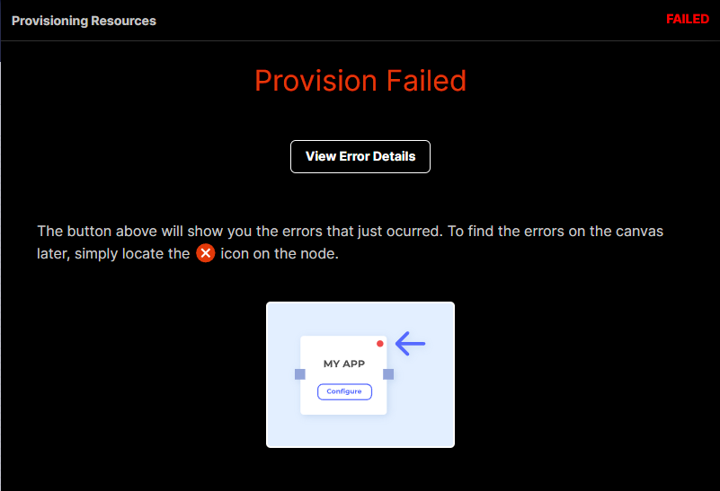
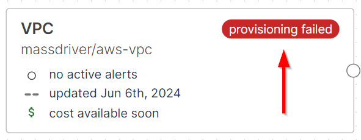
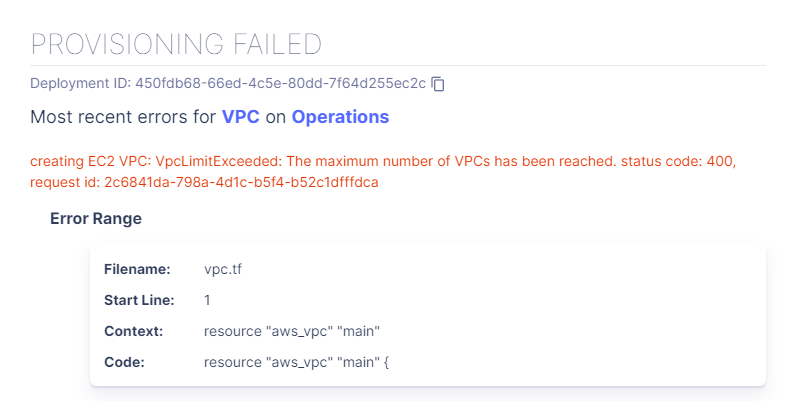
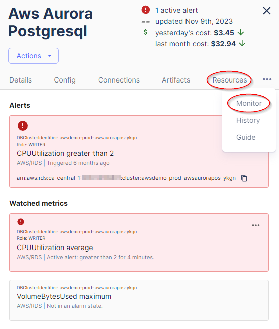

## Troubleshooting Guide

:::note

This guide will help you troubleshoot common issues you might encounter while using Massdriver. If you'd like to add more troubleshooting tips, feel free to contribute to the [Massdriver Docs](https://github.com/massdriver-cloud/docs) repo.

:::

<details>
<summary><h3>Bundle deployment failure</h3></summary>

When a bundle deployment fails, the first thing to do is to check the error message. You can do that by clicking **View Error Details** on the deployment drawer or clicking on the failed state of the bundle (examples below).




The error message will give you an indicator on what went wrong. 


If you can't figure out the issue, please reach out to us on the [community Slack channel](./troubleshooting.md#resources).
</details>

<details>
<summary><h4>Bundle alarm is triggerred</h4></summary>

When a bundle alarm is triggered, that means that the threshold you set for the metric has been met. You can check the alarm details by clicking on your bundle and viewing either the **Details** tab or the **Monitor** tab.

</details>

<details>
<summary>Save/Deploy buttons aren't working</summary>

There are a few reasons why the save/deploy buttons might not be working. Here are a few things to check:
* Reload browser as you might have been logged out
* Check if your [environment](./concepts/05-targets.md) has default credentials assigned
* Clear cache and cookies
* Review your `massdriver.yaml` file for any params that are **required** but do not exist (example below)

```yaml title="massdriver.yaml"
params:
    required:
        - foo
        - bar
    properties:
        bar:
            type: string
            title: Bar
```
</details>

<details>
<summary>Missing Configuration for Required Attribute</summary>

```
Details
Must set a configuration value for the permission attribute as the provider has marked it as required.Refer to the provider documentation or contact the provider developers for additional information about configurable attributes that are required.
 
Error Range
Filename: .terraform/modules/helm.application/massdriver-application/main.tf
Start Line: 63
Context: resource "mdxc_application_permission" "main"
Code: permission = each.value
```

This issue is related to Massdriver's MDXC provider failing to assign the declared permission to the application's identity.

**Fix**
* This error message could be referring to an outdated `massdriver-application` module. To fix this, update the module ref in `src/main.tf` of your application template to the newest [SHA](https://github.com/massdriver-cloud/terraform-modules/commits/main/). Then, run `mass bundle publish` to publish your changes to Massdriver. Lastly, redeploy your application to apply the changes.
* There could also be IAM policies declared in your `massdriver.yaml` file that the upstream bundle does not support or can't find. Be sure to review the `env/policies` block in your `massdriver.yaml` compared to the `src/_artifacts.tf` file in your upstream bundle for available policies.

#### Proper IAM policy application:
```yaml title="massdriver.yaml"
app:
    policies:
        - .connections.s3.data.security.iam.read

connections:
    required:
        - s3
    properties:
        s3:
            $ref: massdriver/aws-s3-bucket
```
```hcl title="src/_artifacts.tf"
resource "massdriver_artifact" "bucket" {
  field                = "bucket"
  provider_resource_id = aws_s3_bucket.main.arn
  name                 = "AWS S3 Bucket: ${aws_s3_bucket.main.arn}"
  artifact = jsonencode(
    {
      data = {
        infrastructure = {
          arn = aws_s3_bucket.main.arn
        }
        security = {
          iam = {
            read = {
              policy_arn = aws_iam_policy.read.arn
            }
            write = {
              policy_arn = aws_iam_policy.write.arn
            }
          }
        }
      }
      specs = {
        aws = {
          region = var.bucket.region
        }
      }
    }
  )
}
```
</details>

<details>
<summary>Provisioning Failed is blank</summary>

If you see a blank window where the provisioning failed message should be, it means that the deployment failed before the provisioning step. This is likely due to a misconfigured `massdriver.yaml`. Some things to check are:
* Lint your `massdriver.yaml` file to ensure there are no syntax errors using `mass bundle lint`
* Review your `massdriver.yaml` file for any missing param. Remember, any config in your IaC mapped to a variable must be defined in the `massdriver.yaml` file as either a `param` or `connection`.

```hcl title="main.tf"
resource "random_pet" "foo" {
    name     = var.name
    location = var.location.data.region
    tag      = var.tag
}
```
```yaml title="massdriver.yaml"
params:
    required:
        - name
        - tag
    properties:
        name:
            type: string
            title: Name
        tag:
            type: string
            title: Tag

connections:
    required:
        - location
    properties:
        location:
            $ref: massdriver/location
```
</details>

<details>
<summary>There are upstream resources dependent on the resource you are trying to delete</summary>

If you are trying to delete a resource that has upstream resources dependent on it, you will see an error message like the one below:

> There are upstream resources dependent on the *resource* in *environment*. Before decommissioning this, you'll need to disconnect or decommission all connected upstream packages.

What this means is that the bundle you're trying to decommission has other bundles that depend on it. To decommission the bundle, you will need to decommission the dependent bundles first. You can do this by going to the dependent bundles and decommissioning them (Actions -> Decommission). Once all dependent bundles are decommissioned, you can decommission the original bundle.
</details>

<details>
<summary>Provisioning Failed: data.terraform.deletion_violations</summary>

If you see `data.terraform.deletion_violations` in the provisioning failed message, it means that the change you are deploying will delete a resource that is listed in the `validations.json` file of the bundle. This file is used to prevent the **accidental** deletion of resources that are critical to the bundle's operation based on a change to the bundle's configuration.

#### For example: 
In IaC, if you change the name of a resource, Terraform will destroy the existing resource and create a new one with the new name. If the resource is critical to the bundle's operation, the deployment will fail because the resource is listed in the `validations.json` file.
</details>

## Resources

* [Join the community Slack](https://join.slack.com/t/massdrivercommunity/shared_invite/zt-1sxag35w2-eYw7gatS1hwlH2y8MCmwXA)
* [Massdriver Learning Center](https://app.massdriver.cloud/learning)
* [YouTube](https://www.youtube.com/@massdrivercloud)
