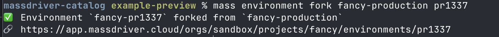
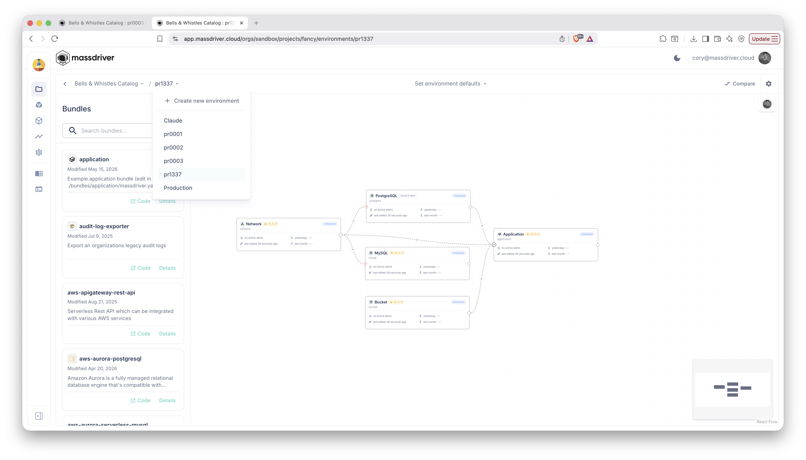

# Fork an Environment

A **fork** is a new environment seeded from an existing one. The new env
sits in the same project (the project is the *parity boundary* — every env
within it has the same canvas), references its parent via the `parent`
field, and every instance starts with the parent's params, version, and
release channel.

Use a fork when you need a controlled copy of an env that you can diverge
from: spin up staging from prod, ramp a developer's personal env off
staging, stage a major version migration in isolation.

## What `forkEnvironment` actually does

One API call, all four steps happen inside the same transaction:

1. Creates the new environment, linked to its parent.
2. Initializes one instance per component in the project's blueprint.
3. Seeds every instance's `params` from the parent's matching instance
   (filtered through the bundle's `$md.copyable` annotations).
4. Optionally copies environment defaults, secrets, and remote-reference
   overrides — three independent `--copy-*` flags you opt into.

If any of those steps fail, the whole thing rolls back. There is never a
half-forked env to clean up.

## The CLI

```bash
mass environment fork <parent-environment> <new-ID> [flags]
```

- `parent-environment` is the full identifier of the env you're forking from
  (e.g. `ecomm-production`).
- `new-ID` is the **local** segment of the new env's identifier. Must match
  `^[a-z0-9]{1,20}$` — lowercase alphanumeric only, no dashes. The full
  identifier becomes `<project>-<new-ID>`.

### Flags

- `--copy-environment-defaults` — carry the parent's default resource
  connections (the canvas-level defaults) into the fork.
- `--copy-secrets` — copy every instance's secrets from the parent. Same
  semantics as `mass instance copy --copy-secrets`, fanned out to every
  instance in one call.
- `--copy-remote-references` — copy every instance's remote-reference
  overrides from the parent.
- `--name`, `--description`, `--attributes` — same as `environment create`.
  `--attributes` is required when the org has declared attribute-shaped
  ABAC policies at the environment scope.

## Examples

```bash
# Stand up a staging env from production, carrying credentials forward.
mass environment fork ecomm-production staging \
  --copy-environment-defaults \
  --copy-secrets

# Personal dev env off staging, no secrets.
mass environment fork ecomm-staging alicedev

# Re-running is safe — reset edits and pull in updated parent state.
mass environment fork ecomm-production staging --copy-environment-defaults
```



The new env shows up immediately alongside its siblings in the project's
environment list:



The same operation is available in the UI when you need a one-off rather
than a scripted run:

<video controls loop muted playsInline width="100%">
  <source src="/img/screenshots/create-environment.webm" type="video/webm" />
</video>

## Re-fork resets the fork

`forkEnvironment` is a **converge**, not a one-shot create. Re-running it
against the same parent with the same `new-ID` re-runs the seed:

- Params and version reset to the parent's *current* values (any local
  edits are clobbered).
- Environment defaults re-apply (idempotent upserts).
- `--copy-*` flags re-fire — so you can re-fork with `--copy-secrets` to
  *backfill* secrets that a prior call didn't request.

Re-forking with a **different** parent is rejected. A fork's parent is
immutable.

## What's not copied

Out of the box, a fork only copies what `copyInstance` does for a single
instance: params (minus bundle-marked non-copyable fields), version, and
release channel. Secrets and remote references stay opt-in via the two
flags. If you need finer control — different secrets per instance,
specific remote references — combine `fork` with [per-instance
promotes](/workflows/promote).

## When `fork` is the wrong tool

- **One-off changes to an existing env.** Don't fork, then merge back.
  Just edit the env directly.
- **You want every env in lockstep.** Forks diverge over time. If you
  need parity, the project is already that parity boundary — each env
  inherits the same blueprint without needing to be a fork of another.
- **Cross-project clones.** Forks live in the same project as their
  parent. To duplicate infrastructure across projects, the right tool is
  [Clone Project](/cli/commands/mass_project) (different command, same
  pattern).

## Reference

- CLI command: [`mass environment fork`](/cli/commands/mass_environment) — see the `fork` subcommand.
- API mutation: `forkEnvironment` in the V2 schema.
- Concepts: [Projects & Environments](/concepts/projects-and-environments).
